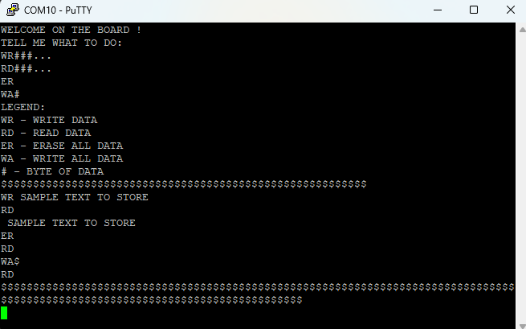

# serial-access-EEPROM-memory-management-system

## 📌Overview
This repository is a C language code file for STM32 board. EEPROM_M93C46.c file contains functions which enables managing serial EEPROM memory chip M93C46 with MICROWIRE™ standard connected to a board. A memory chip is managed by special codes sending to the STM32 board from a PC via serial termianl (eg. PuTTy). There is also the necessary configuration of USART. It is possible to manage more than one memory chip. The file will work with Nucleo F334R8 board, or any board with similar peripherials.

## Why it is useful ?
It can be used for managing any single memory chip. Thanks to this you can for eg. read content from a desoldered memory chip.

## Getting started 
You need any Nucleo F334R8 board (in the future it will be extended to any STM32 board). You can also use boards similar to F334R8. You also need a PC with serial terminal (eg. PuTTy).
Next ou have to connect somehow a memory chip to a board. Below is shown typical usage in the main function.
```c
#include "main.h"
#include "stm32f3xx.h"
#include "EEPROM_M93.h" // INCLUDING THE FILE 

EEPROM_M93_TypeDef memory1; // CREATING MEMORY OBJECT 

int main(void)
{
	memory1.GPIOAddress =  GPIOB; // SELECTING GPIO PORT WITH USED PINS
	memory1.D = 0; // PIN'S NUBER FOR DATA INTO THE MEMORY SIGNAL
	memory1.S = 1; // PIN'S NUBER FOR SELECT SIGNAL
	memory1.Q = 2; // PIN'S NUBER FOR DATA FROM THE MEMORY SIGNAL
	memory1.frequency = (uint32_t) 100000; // CLOCK FREQUENCY
	EEPROM_M93_config(&memory1); // CONFIGURATING FUNCTION 
	USART_config(); // USART CONFIGURATION FUNCTION
	while (1){
    // WAIT
	}
}
To get started you have to firstly connect the board to PC, then open a terminal and then reset the board. The entry text will be shown on the terminal's window. There are
described avaible codes to controll the memory.
```
The screenshot below shows terminal with all of the operatins executed.



While opening PuTTy it is good to properly set some options. The screenshot below shows some settings. First you have to set connection type - serial, then select a COM port (you can check which COM is connected with the bord in device manager) and finally set speed to 9600.


In the Terminal cart select Implict CR in every LF, Local echo - Force on, Local line editing - Force on as shown below.


Currently it is possible to change clock frequency or memory bytes by changing values in EEPROM_M93C46.h file. 
```c
#define USART_BRR 0xD05 // 9600 BAUD FOR 32MHz CLOCK
#define MemoryBytes 128 // NUMBER OF BYTES IN THE MEMORY
```
It is also possible to chenge word length from x8 to x16 but if this parameter changes it will be necessary to change frames of data sending to the memory while performing writting or reading operations.


